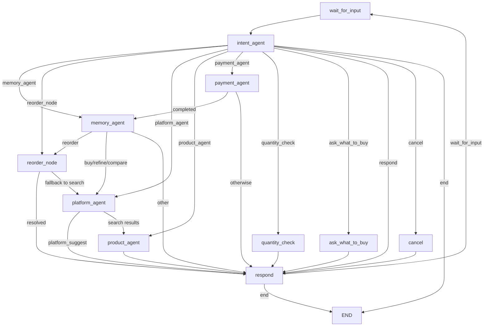
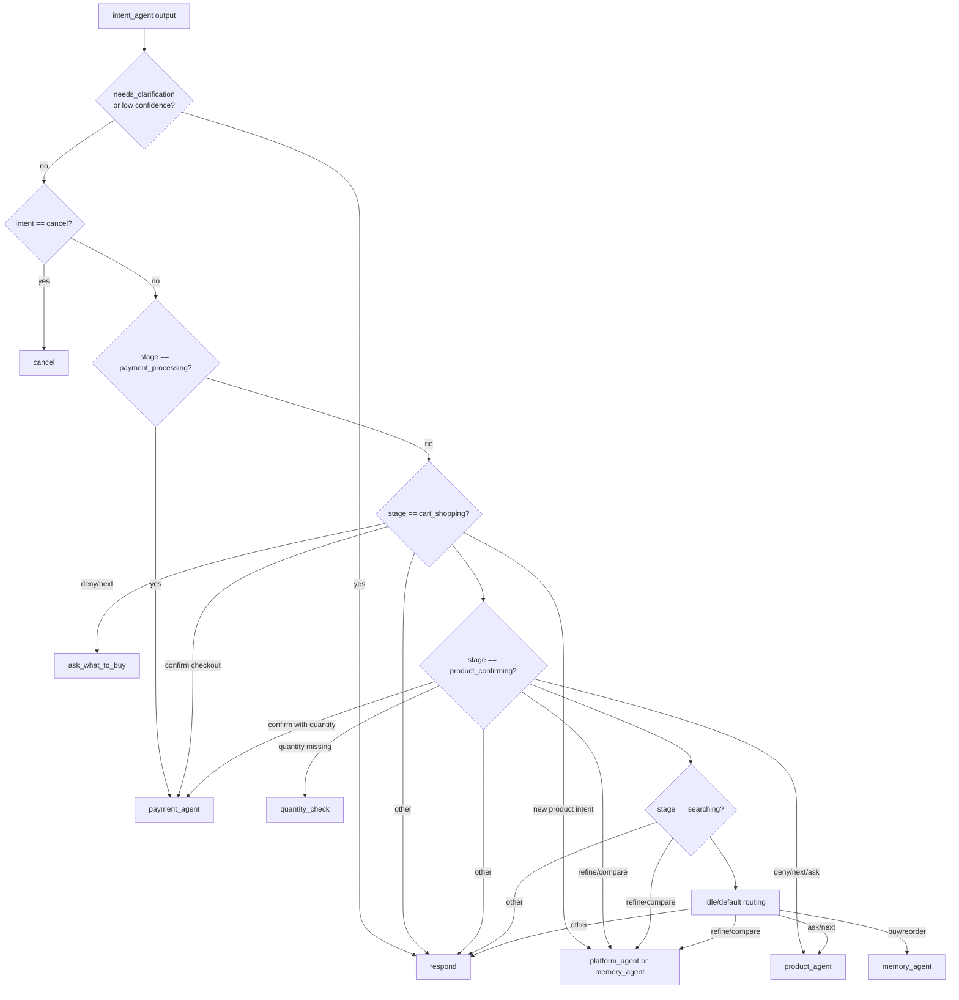
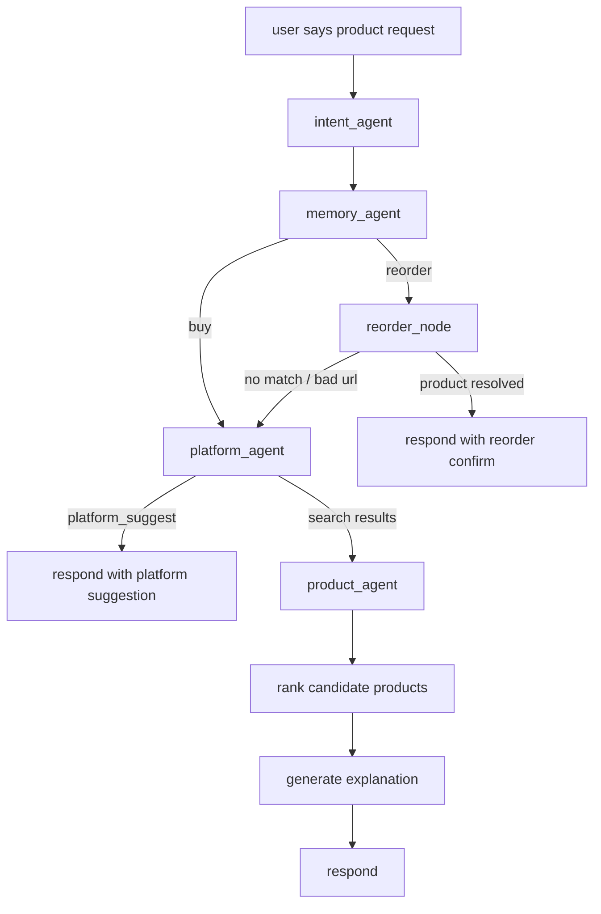
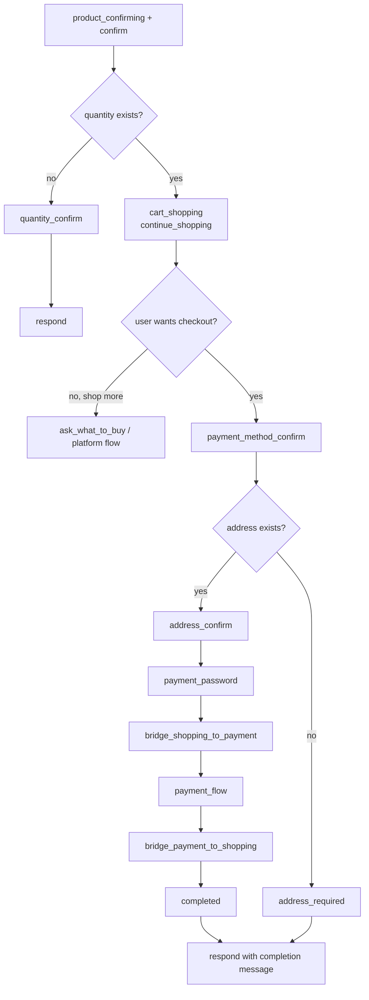
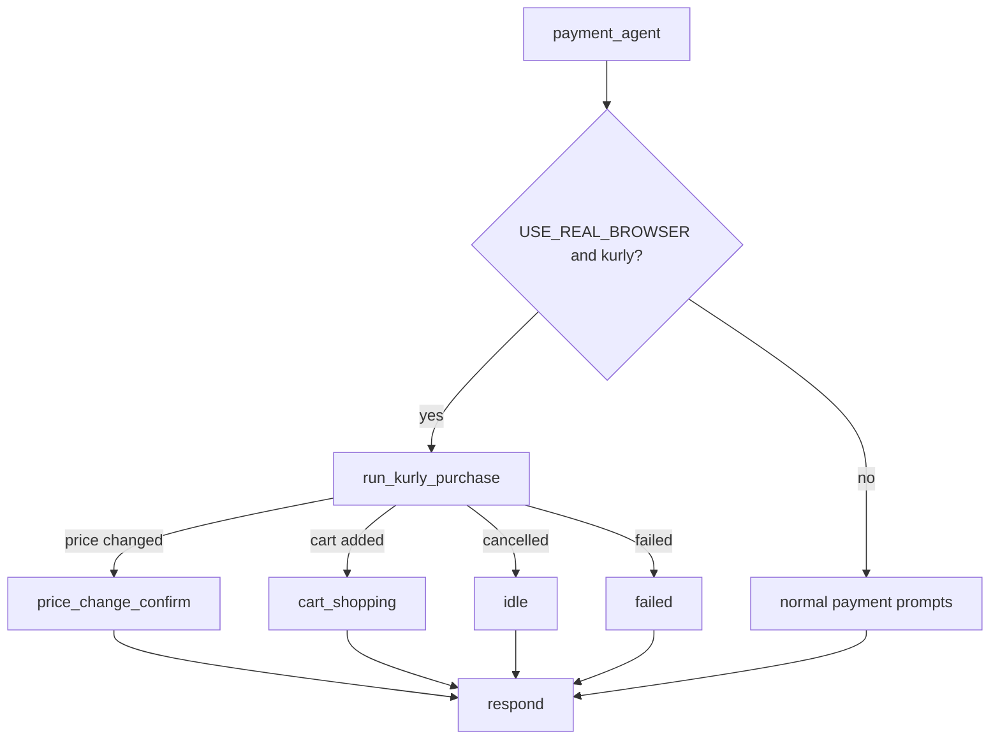
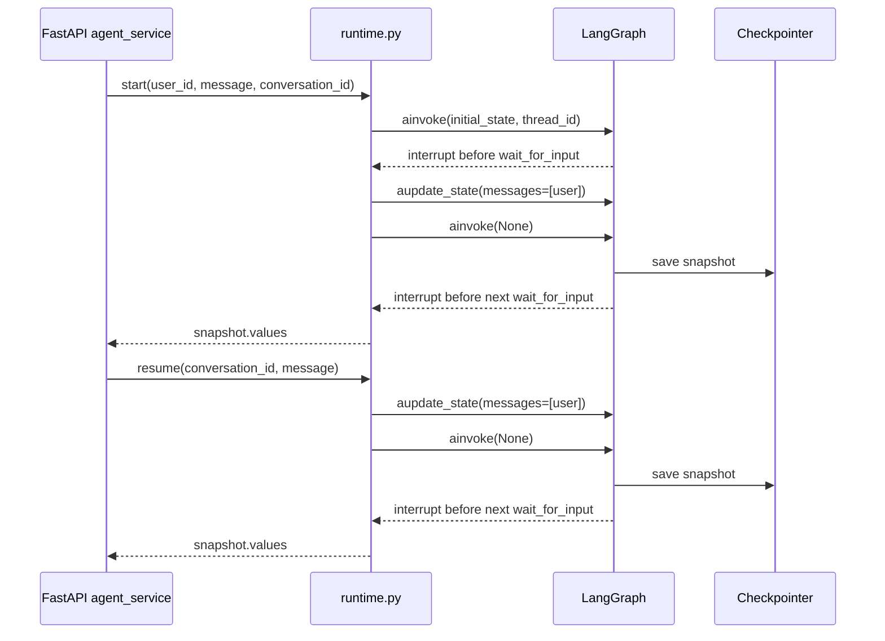
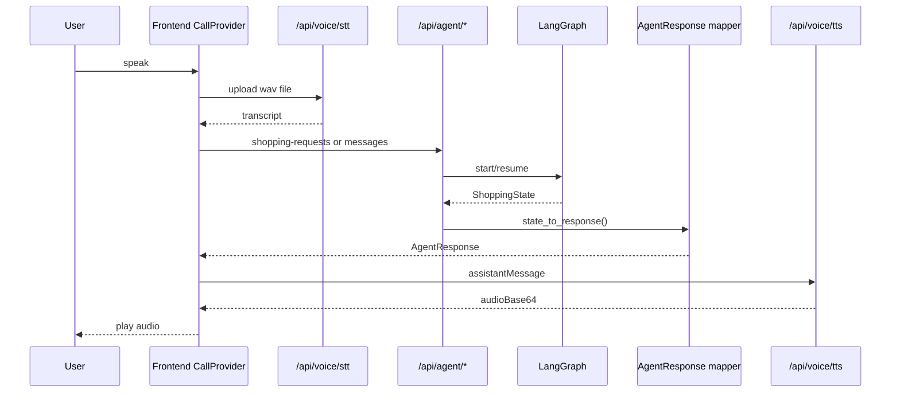
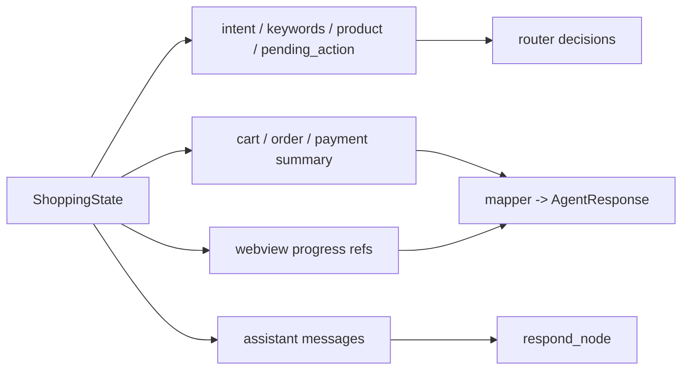

# LangGraph Mermaid Diagrams

이 문서는 현재 코드 기준 LangGraph 오케스트레이션 구조를 `mermaid`로 빠르게 확인하기 위한 다이어그램 모음입니다.

기준 코드:
- `backend/vendor/ddalangoo-langgraph/src/graph/builder.py`
- `backend/vendor/ddalangoo-langgraph/src/graph/router.py`
- `backend/vendor/ddalangoo-langgraph/src/payment/subgraph.py`
- `backend/app/agent/runtime.py`
- `backend/app/agent/mapper.py`

## 1. Main Orchestrator Graph

설명:
- `intent_agent`가 발화를 구조화한 뒤 `router`가 다음 노드를 고릅니다.
- `memory_agent`는 재구매 문맥 또는 선호도 컨텍스트를 준비합니다.
- `platform_agent`는 검색 플랫폼을 고르고, `product_agent`는 랭킹/설명을 만듭니다.
- `payment_agent`는 장바구니/결제 단계 상태를 전개합니다.
- 실제 사용자에게 들려줄 문장은 마지막 `respond` 노드에서 확정됩니다.

## 2. Router Decision Map

설명:
- 같은 `"응"`도 현재 `stage`와 `pending_action.type`에 따라 전혀 다른 노드로 갑니다.
- 이 프로젝트의 핵심 분기 기준은 `intent` 하나가 아니라 `intent + stage + pending_action` 조합입니다.

## 3. Product Discovery Flow

설명:
- 일반 구매는 `memory_agent -> platform_agent -> product_agent` 흐름이 기본입니다.
- 재구매는 `memory_agent -> reorder_node`로 바로 재주문 후보를 고를 수 있습니다.

## 4. Payment Flow

설명:
- 현재 결제는 완전 독립 그래프라기보다 `payment_agent_node` 안에서 `pending_action.type` 기반으로 단계가 전개됩니다.
- 실제 DB `cart/order/payment` 생성은 LangGraph 밖 `agent_service` 후처리가 담당합니다.

## 5. Real Browser / WebView Branch

설명:
- 컬리 실브라우저 모드가 켜지면 `payment_agent` 안에서 Playwright 웹뷰 자동화로 분기합니다.
- 이 경로는 `webview_progress`와 연결되어 프론트의 `asyncStatus`에도 반영됩니다.

## 6. Runtime Resume Model

설명:
- `thread_id = conversation_id`로 같은 대화를 이어갑니다.
- 한 턴이 끝날 때마다 상태 스냅샷이 저장되고, 다음 입력에서 이어서 재개됩니다.

## 7. Frontend to Voice to LangGraph Sequence

설명:
- LangGraph 내부 state는 프론트로 직접 가지 않습니다.
- `mapper.state_to_response()`가 프론트가 쓰는 `AgentResponse` 계약으로 변환합니다.

## 8. State Ownership Summary

설명:
- 실질적으로 `ShoppingState`가 시스템의 단일 작업 메모리 역할을 합니다.
- 프론트 UI 전환도 결국 `stage`, `pending_action`, `messages`에서 파생됩니다.
