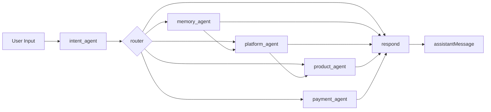
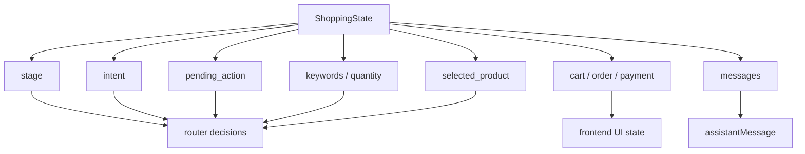
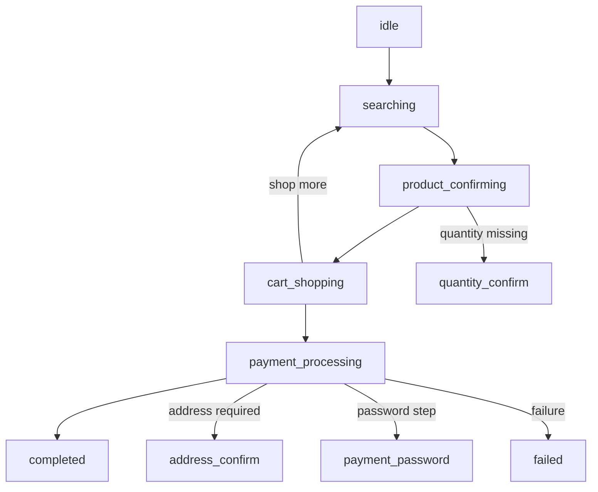
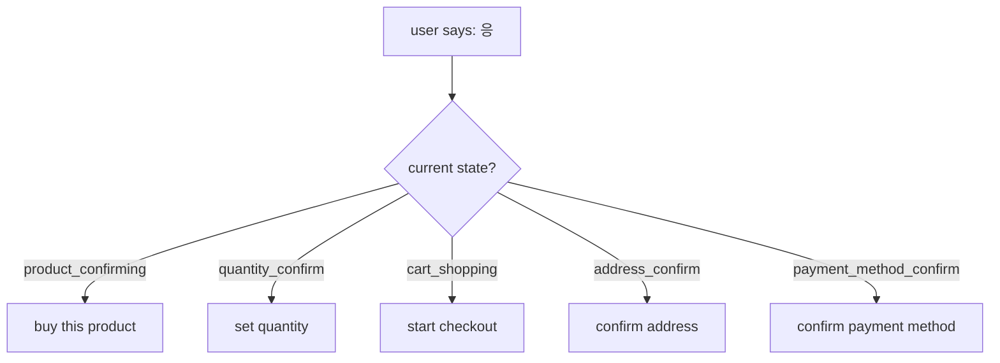
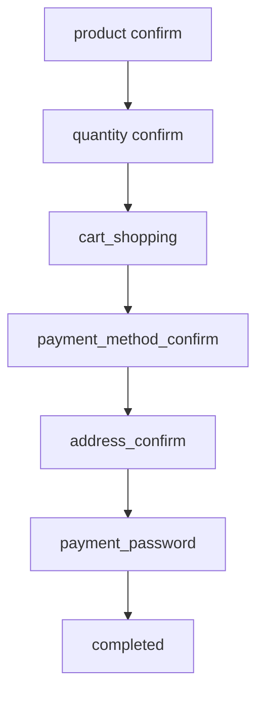
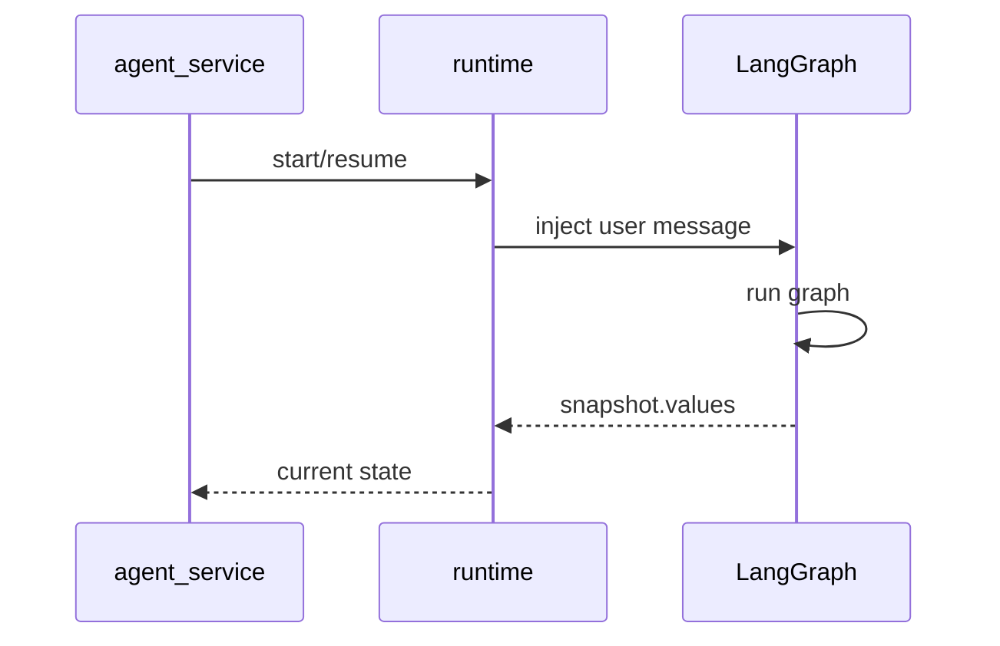
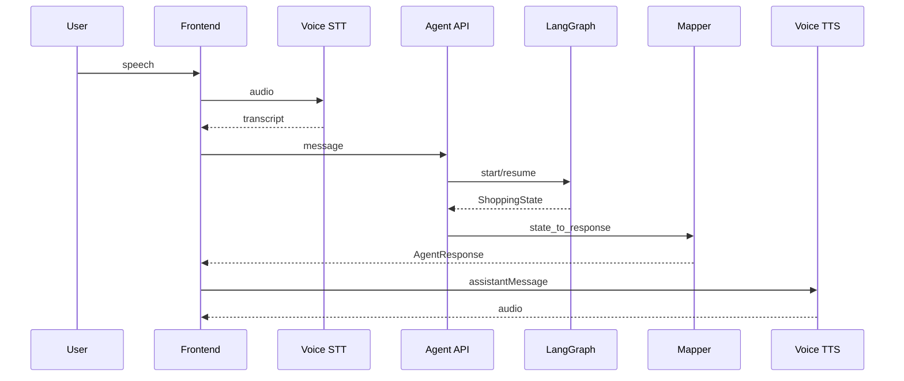

# LangGraph Presentation Version

발표용으로 바로 보여주기 좋은 축약 버전입니다.

## Slide 1. One-Screen Summary

핵심 메시지:
- LangGraph는 “한 번에 답변 생성”이 아니라 “의도 해석 -> 라우팅 -> 전문 노드 실행 -> 응답 생성” 구조입니다.
- 각 노드는 역할이 분리되어 있고, 마지막에만 사용자에게 들려줄 문장이 확정됩니다.

## Slide 2. State-Centered Design

핵심 메시지:
- 이 시스템의 중심은 LLM이 아니라 `ShoppingState`입니다.
- 노드들은 state를 읽고 갱신하고, 라우터와 응답 생성이 그 state를 기준으로 동작합니다.

## Slide 3. Main Conversation Flow

핵심 메시지:
- 전체 경험은 상태 머신처럼 움직입니다.
- 같은 사용자 발화도 현재 상태에 따라 의미가 달라집니다.

## Slide 4. Why Router Matters

핵심 메시지:
- 이 시스템은 문장 자체보다 “문맥”을 더 중요하게 봅니다.
- `router`가 `intent + stage + pending_action`을 함께 봐야 자연스러운 대화가 됩니다.

## Slide 5. Payment Subflow

핵심 메시지:
- 결제는 별도 세부 단계가 있는 서브플로우입니다.
- 다만 완전 별도 시스템이라기보다 `payment_agent` 안에서 관리되는 상태 전개에 가깝습니다.

## Slide 6. Runtime Model

핵심 메시지:
- 턴마다 새로 생성하는 챗봇이 아니라, 대화 상태를 저장하고 이어가는 그래프입니다.
- `conversation_id` 단위로 resume 됩니다.

## Slide 7. End-to-End Architecture

핵심 메시지:
- LangGraph는 대화 결정 계층입니다.
- 프론트/STT/TTS/DB 트랜잭션은 바깥 계층이 담당하고, 최종적으로 `AgentResponse`로 연결됩니다.

## 발표 팁

- 1장만 보여줄 거면 `Slide 3. Main Conversation Flow`를 대표로 쓰는 게 가장 직관적입니다.
- 아키텍처 강조가 목적이면 `Slide 1` 다음 `Slide 7` 순서가 좋습니다.
- “왜 LangGraph를 썼는가”를 설명하려면 `Slide 2`와 `Slide 4`를 붙이면 설득력이 좋습니다.
